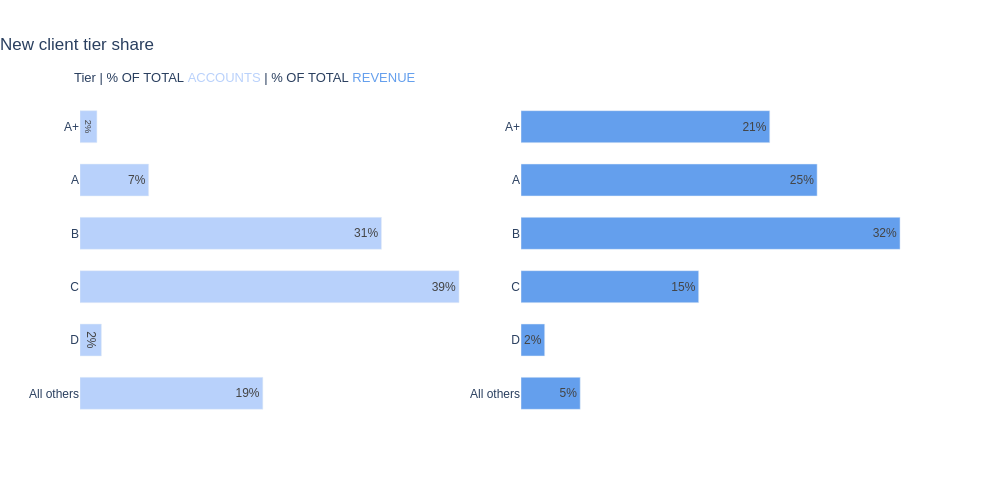
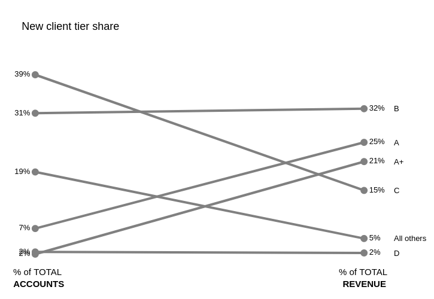

# storytelling-with-data
In this repository I am sharing my studies of storytelling with data, based on the book by Cole Nussbaumer: Storytelling with data: Let's Practice!.
Storytelling with data is a great book to get the hold of how to methodically and creatively analyze your data and communicate what is truly important to your audience. It encourages you to be concise, creative and straight to the point, no clutters. 

Ths repository will then be where I'll share my practices. I am using Plotly for the moment, but will possibly try out new tools to generate visuals. PowerBI is right ahead in my list.  

# Visuals

In the first exercise of the book we are asked to make a given table look better in different ways. These are the ways I've made them. I found out that Plotly enables the use of basic html language, which was a nice surprise and my first contact with the language!

## The table

## % Accounts vs Revenue: First Graph

## % Accounts vs Revenue: Second Graph

## % Accounts vs Revenue: Third Graph

## % Accounts vs Revenue: SlopeGraph

